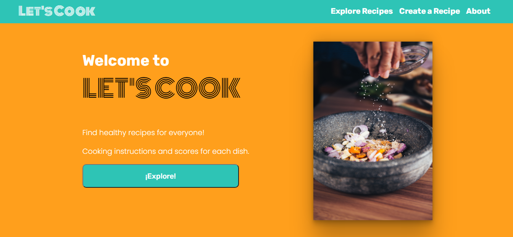
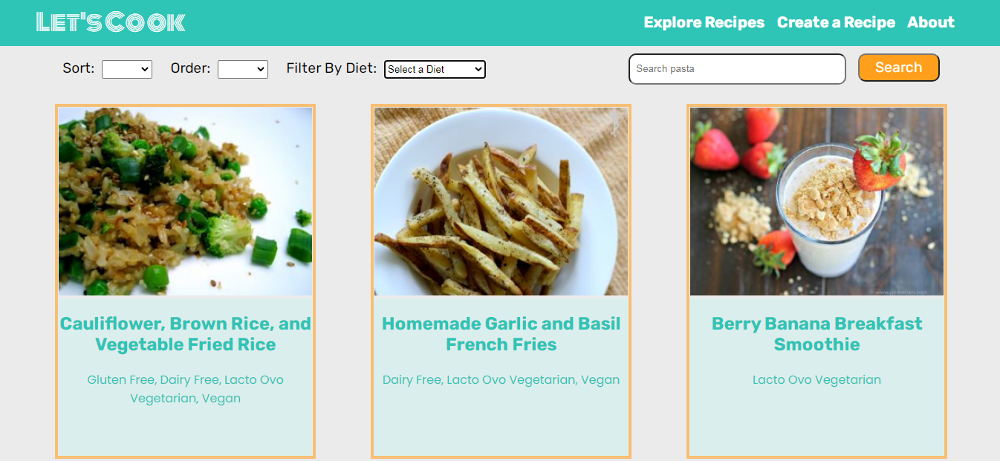
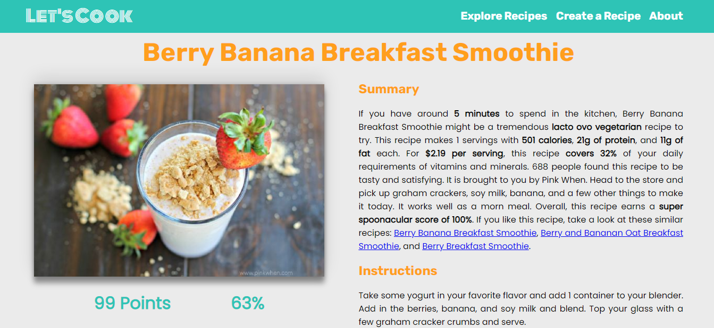
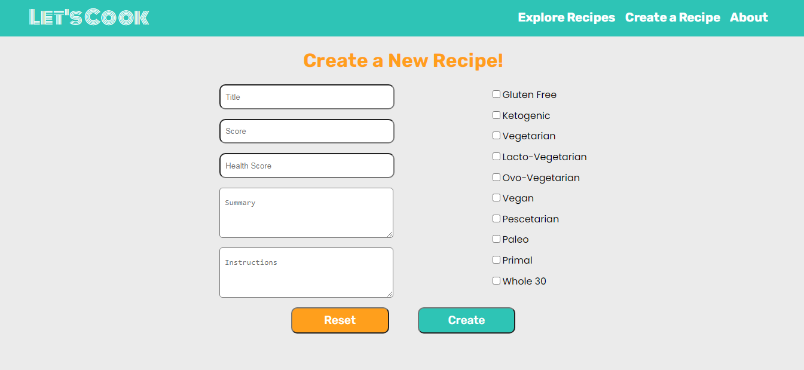

# Let's Cook

Let's Cook fue desarrollado durante el bootcamp en Henry. El objetivo fue construir una App usando React JS, Redux, Node JS, Express JS, Sequelize y PostgreSQL. Además de la Api de comida de Spoonacular.
Conectar los conceptos aprendidos en el curso.
Aprender las mejores prácticas.
Aprender y practicar el flujo de trabajo de GIT.
Utilizar y practicar algunas pruebas.

## Funcionalidades

El proyecto permite visualizar recetas de varios platos, también se puede hacer búsquedas por una palabra clave. Además, de realizar ordenamientos tanto alfabéticamente, como por el puntaje. También se puede filtrar por dietas.

